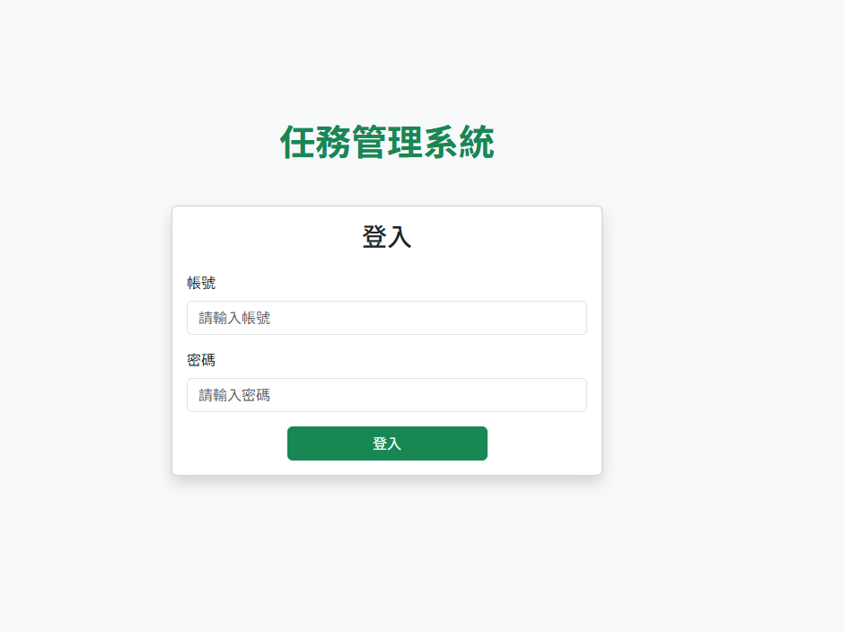
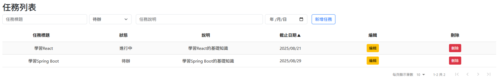
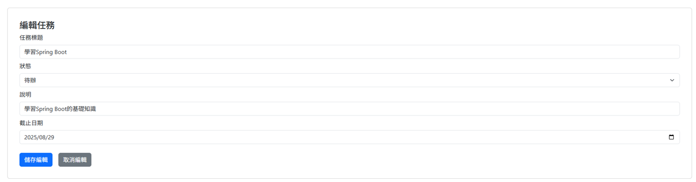
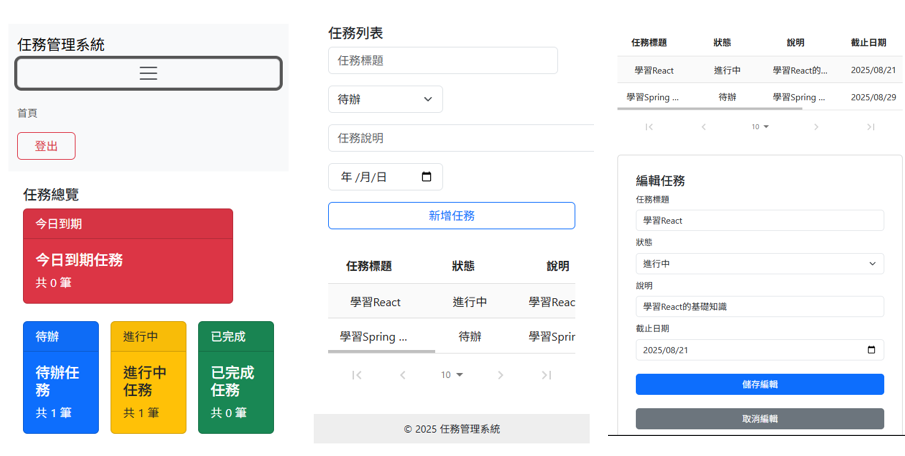

# 任務管理系統 (Todo App)

一個現代化的任務管理應用程式，使用 React 開發，提供直觀的介面來管理日常任務和待辦事項。


---

## ✨ 功能特色

### 🔐 身份驗證
- JWT Token 驗證登入系統
- 自動登入狀態檢查
- 安全的登出機制

### 📋 任務管理
- ✅ 新增、編輯、刪除任務
- 🔄 任務狀態管理（待辦、進行中、已完成）
- 📅 截止日期設定和追蹤
- 📝 任務詳細說明
- 🔍 任務欄位排序

### 📊 資料視覺化
- 📈 任務狀態統計卡片
- ⏰ 今日到期任務提醒
- 📱 響應式介面設計

### 🎨 使用者體驗
- 現代化 UI 設計
- 手機響應式佈局
- 直觀的操作介面
- 即時資料更新

---

## 🛠 技術棧

### 前端技術
- **React 18+** - 現代化前端框架
- **React Router DOM** - 客戶端路由
- **React Bootstrap** - UI 元件庫
- **Bootstrap 5.3** - CSS 框架

### 資料處理
- **React Data Table** - 表格元件
- **Axios** - HTTP 請求
- **Custom API Service** - API 服務層

### 開發工具
- **Docker** - 容器化部署
- **Nginx** - Web 伺服器

---

## 📂 專案結構

```
todo-app/
├── public/                 # 靜態資源
│   ├── index.html         # HTML 模板
│   └── manifest.json      # PWA 配置
├── src/
│   ├── components/        # 共用元件
│   │   ├── Navbar.js     # 導航列元件
│   │   └── Footer.js     # 頁尾元件
│   ├── pages/            # 頁面元件
│   │   ├── Login.js      # 登入頁面
│   │   ├── Home.js       # 主頁面
│   │   └── Default.js    # 任務管理頁面
│   ├── services/         # API 服務
│   │   └── api.js        # API 封裝
│   ├── App.js           # 主應用元件
│   ├── App.css          # 樣式檔案
│   └── index.js         # 應用入口
├── Dockerfile           # Docker 配置
├── nginx.conf          # Nginx 配置
└── package.json        # 依賴管理
```

---

## 🚀 快速開始

### 環境需求
- Node.js 18+
- npm 或 yarn
- 後端 API 服務

---

## ⚙️ 環境變數

| 變數名稱            | 說明              | 預設值                  |
| ------------------- | ----------------- | ----------------------- |
| `REACT_APP_API_URL` | 後端 API 基礎 URL | `http://localhost:8080` |

---

## 🔌 API 整合

### 身份驗證
```javascript
POST /api/login
{
  "username": "string",
  "password": "string"
}
```

### 任務操作
```javascript
GET /api/tasks          # 取得所有任務
POST /api/tasks         # 新增任務
PUT /api/tasks/:id      # 更新任務
DELETE /api/tasks?id=:id # 刪除任務
```

---

## 📱 響應式設計

- 桌面版：完整功能體驗
- 手機版：觸控友善介面

---

## 👤 作者

**Joan**
- GitHub: [@joan71739](https://github.com/joan71739)
- Email: [joan71739@gmail.com]

---

## 📸 預覽截圖

### 登入頁面
現代化的登入介面，支援帳號密碼驗證。


### 任務總覽
清楚的狀態卡片顯示，一目了然的任務統計。


### 任務管理
功能完整的任務列表，支援排序。




### 手機介面


---

*最後更新：2025年8月*